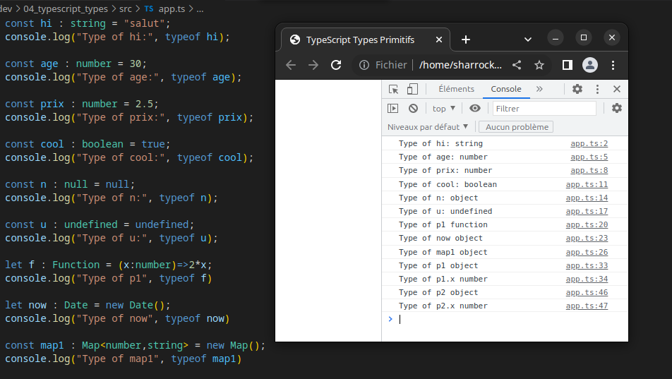

# 04_typeof

:memo: [éditer cette page](https://gitlab.com/-/ide/project/webdev101/04_typeof/edit/main/-/README.md)

## cloner le dépôt

dans VSCode, clonez le dépôt <https://gitlab.com/webdev101/04_typeof.git>

## lire et comprendre

vous devez ensuite lire et comprendre le code source de `src/app.ts` que voici

[src/app.ts](src/app.ts ':include :type=code typescript')


## compiler

compilez dans un terminal avec

```terminal
tsc -w
```

## exécuter

vous devez ouvrir `index.html` dans VSCode et aller dans exécuter > démarrer le débogage (ou appuyer sur F5) et choisir chrome (installez le navigateur Google Chrome si nécessaire).

vous devez ensuite ouvrir la console du navigateur pour voir la sortie.



vous pouvez aussi voir la debug console dans VSCode qui reproduit la sortie de la console du navigateur.

